
 
  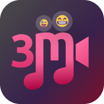

<h1 align="center">MusicMovieMood</h1>

  
  
  
  
  
  
  

  <a href="#dart-about">À propos</a> &#xa0; | &#xa0; 
  <a href="#sparkles-Fonctionnalitées">Fonctionnalitées</a> &#xa0; | &#xa0;
  <a href="#rocket-technologies">Technologies</a> &#xa0; | &#xa0;
  <a href="#white_check_mark-requirements">Requirements</a> &#xa0; | &#xa0;
  <a href="#checkered_flag-starting">Starting</a> &#xa0; | &#xa0;
  <a href="#memo-license">License</a> &#xa0; | &#xa0;
  <a href="https://github.com/NDRBAX" target="_blank">Author</a>

 

## :dart: À propos

 

Fan de Batman et de varans en tout genre, j'ai eu l'idée de fusionner les deux et de créer l'application mobile parfaite. C'est comme ça qu'est né MusicMovieMood. Une révolution technologique qui (si c'est publié un jour) vous évitera de vous ennuyer en toute circonstance. Codé en React Native, l'application permet à n'importe qui, de trouver du contenu selon son humeur, tout en prenant en compte le fait qu'il soit seul ou en groupe, avec des amis, avec son/sa chéri-e ou avec un public jeune. Et oui, nous avons pensé à tout.

Aussi, si vous n'êtes pas un moldu du 7ème art, grace à MusicMovieMood, vous avec l'opportunité de découvrir de nouveaux contenus musicaux assez stylés. Dommage que l'application n'est pas encore sortie, n'est-ce-pas.

 

## :sparkles: Fonctionnalités

 

:heavy_check_mark: Trouver un bon film\
:heavy_check_mark: Ou une série\
:heavy_check_mark: Sinon découvrir de la bonne musique

 

## :rocket: Technologies

 

MusicMovieMood a été codé avec les meilleures techniques à la pointe de la technologie moderne.

- [Expo](https://expo.io/)
- [Node.js](https://nodejs.org/en/)
- [React Native](https://reactnative.dev/)

 

## :flower_playing_cards: Aperçu

 

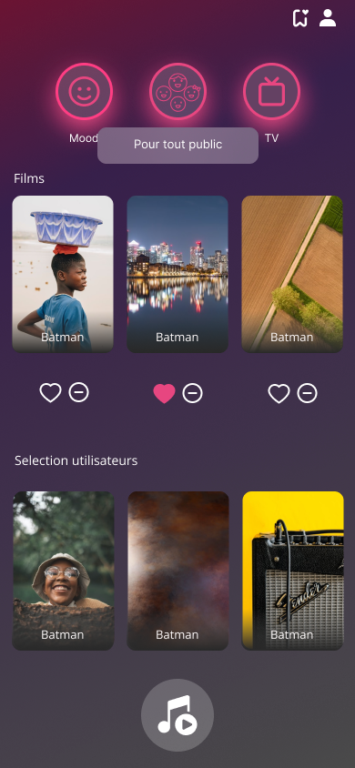
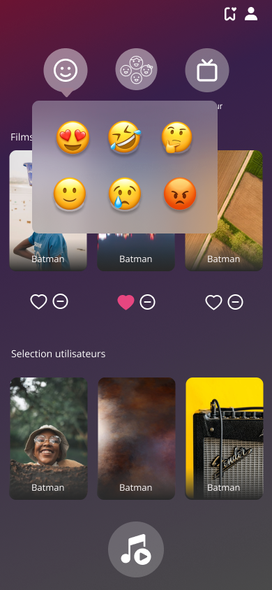
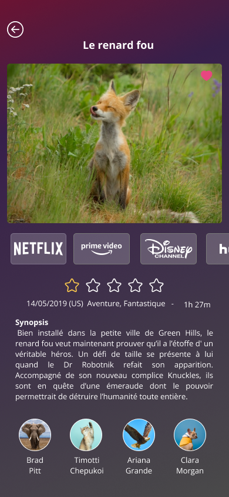
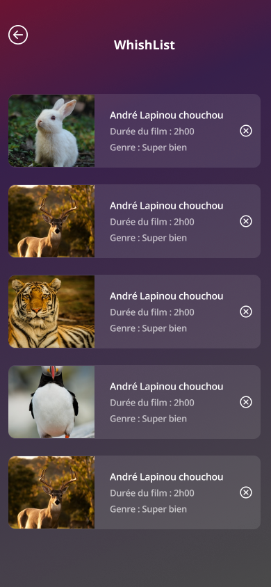
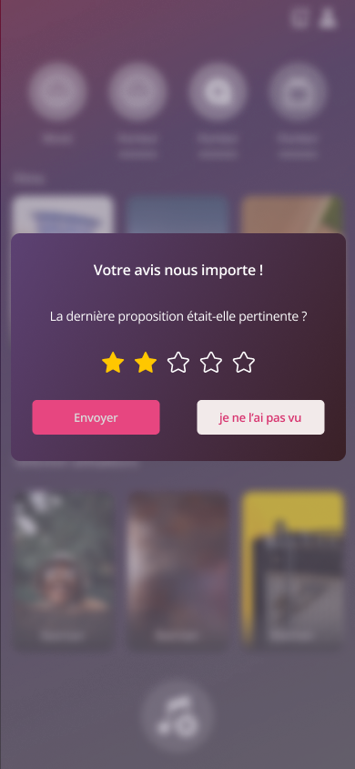
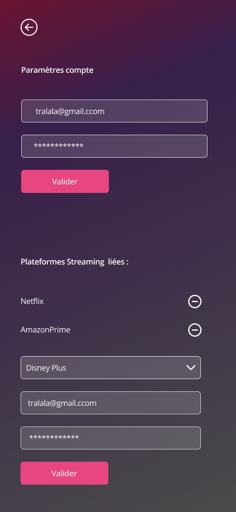
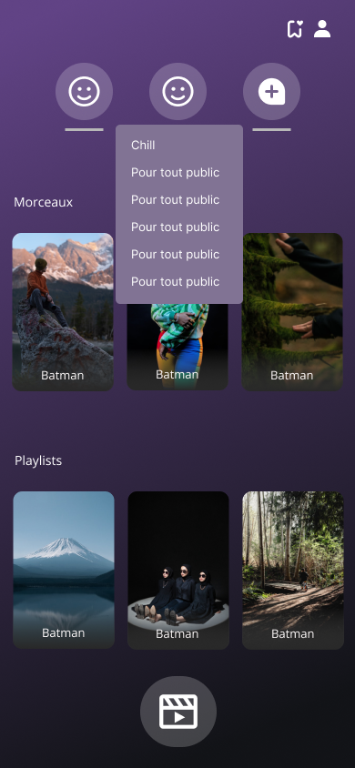
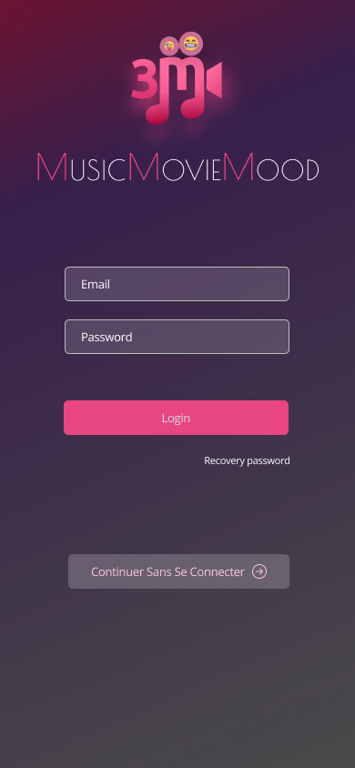
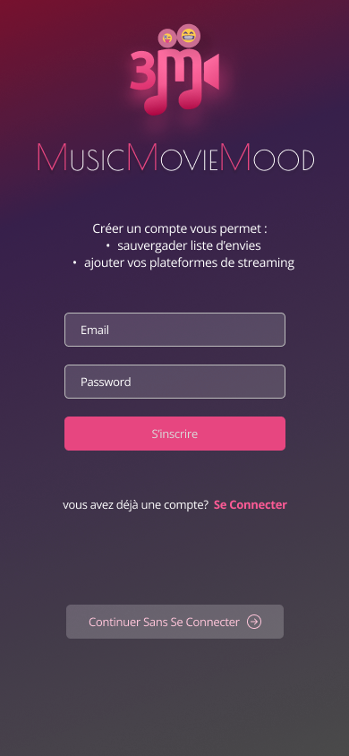

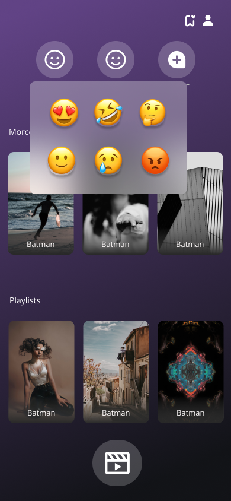

 

## :white_check_mark: Requirements

 

Pour utiliser l'application il vous foit des doigts en bonne santé et un peu de vue.

 

## :memo: License

 

Le projet est sous licence spéciale.

Made with :heart: by <a href="https://github.com/NDRBAX" target="_blank">NDRBAX</a> ! <a href="https://github.com/Charlie7002" target="_blank">Charlie</a> et <a href="https://github.com/ShynoFox" target="_blank">ShynoFox></a> y ont un peu contribué.

<a href="#top">Back to top</a>
